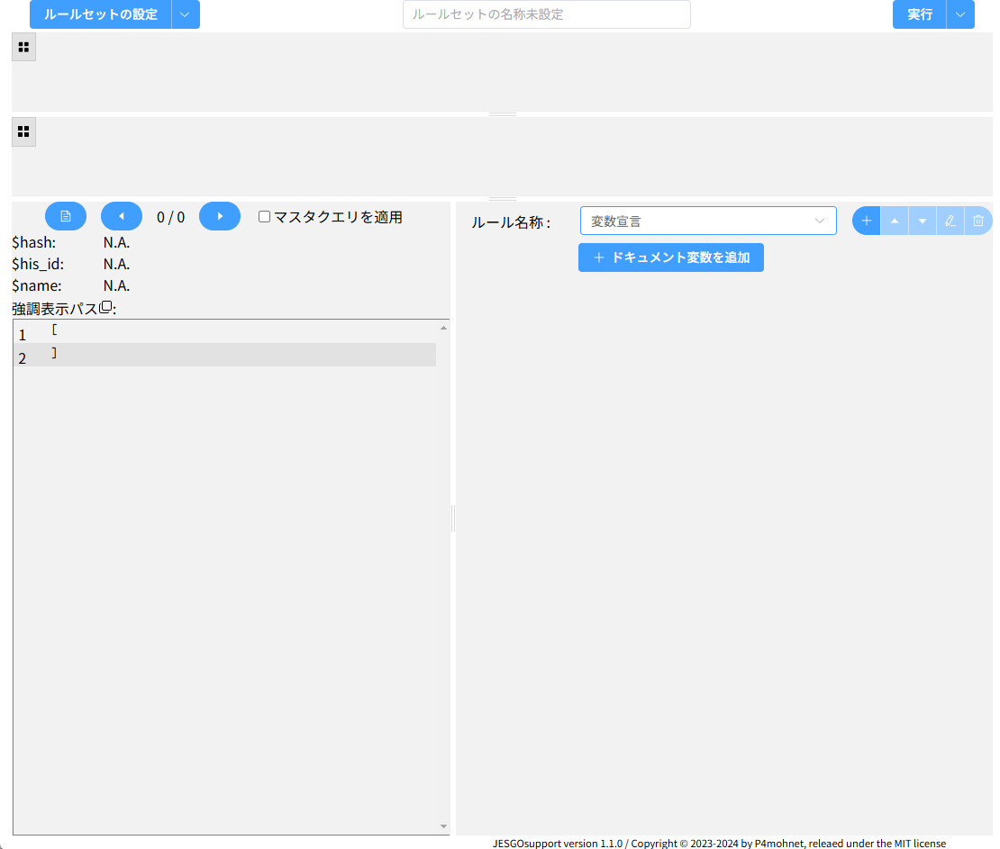

# JESGOサポートツール
JESGOからプラグイン経由で出力された全症例に該当するJSONファイルをCSVに加工するツールです。JSONドキュメントからJSONPathを用いて情報を抽出してそれをルールセットに基づきCSVにマッピングします。  
実際の出力ドキュメントを参照しながら変換ルールを作成できますが、ドキュメント中に全てのドキュメント構造が網羅されることは原則ありませんのでスキーマ定義 https://github.com/jesgo-toitu/jesgo-schema も参照して作業することをお薦めします。

上記の如くでJSONパスに関する知識が必要になります。  
日本語での簡単なJSONパスの資料として https://qiita.com/takkii1010/items/0ce1c834d3a73496ccef があります。また、使用しているライブラリJSONPath Plus https://www.npmjs.com/package/jsonpath-plus のドキュメントも余裕があったら参照することをお薦めします。 

## プラグインの登録
JSONファイルの出力には [/jesgo-plugin/jesgo-json.js](jesgo-plugin/jesgo-json.js) をダウンロードして、JESGOにプラグインとして登録してご利用下さい。  
エラーメッセージのJSONファイルを JESGOに取り込むには /jesgo-plugin/jesgo-error-import.js をJESGOにプラグインとして登録してご利用下さい。

## 本ユーティリティの機能
JSONドキュメントをJSONpathでクロールして値を取得します。順方向性に相対ジャンプで処理の分岐ができます。
基本的に複数の値が取得されることを前提に設計していますが、最終的にはカンマで連結されてセルに保存されます。



### コントロール
画面上段に、ルールセットの設定と保存・読み込みのボタンと、ルールセット名称、実行コントロールのボタンがあります。

画面は4つのペインに分かれており、上からCSVビューア、エラー出力ビューア、JSONビューアとルール管理のペインとなっています。

### ルールセットの設定
ルールセットの各種設定が可能です。

テンプレートを用いることでJESGOから出力されたデータから効率的に患者台帳のみを取り出すマスタクエリを展開できます。

CSV出力制御は、先頭行オフセットの他、Microsoft Excelなどの一部ソフトウエアでの読み込みを考慮した文字コードのShiftJIS設定が可能です。

エラーのターゲットスキーマを省略した場合は、取得したドキュメントの最初に出現したドキュメントのスキーマに```/jesgo:error```プロパティを設定して結果を書き込みます。


### CSVビューア
上から2段目に表示され生成されたCSVを一覧できます。

ボタンでCSVの保存、表示用CSVファイルの読み込みが可能です。

### エラー出力ビューア
上から3段目に表示され生成されたエラー出力を参照できます。

ボタンで情報の保存が可能です。

### JSONビューア
画面左下に表示され、JESGOから出力されたドキュメント部分を症例毎に表示します。

一番左のボタンでJSEGOプラグインから出力された生のJSONファイルを読み込んで解釈ができます。
左右のボタンで複数症例のドキュメントを移動できます。
また、マスタクエリを適応した表示が可能なので、マスタクエリを設定した場合に適切な抽出が行われているかを確認できます。

ドキュメント情報としてハッシュ値、患者ID、患者名が表示されます。 

カーソルがポインタになる行にはJSONポインタが設定されており、クリックで強調表示され、該当するJSONパスを表示します。このJSONパスに基づき、変換ルールの情報源として利用します。

### ルール管理
ルールの選択、作成、削除を行います。＋ボタンで新規作成、ペンマークで名前の変更、ゴミ箱ボタンで現在編集中のルールセットを削除します。同じ名前のルールセットは作成できません。ルールセットを作成して内容の編集が可能になります。

リストに表示された順にルールは処理されるので、上下矢印ボタンで実行順序を移動することが可能です。

### 特別なルールセット～変数宣言
ドキュメント中で参照・書き換え可能な広域変数を定義できます。

バッジに変数の参照数が表示されており、参照がある変数は削除できません。

#### ソース
マクロ実行ユニットに渡す、ドキュメントから取得される情報（ソース）の設定ができます。  
ソースは必要に応じて複数設定できます。JSONパス、患者ID、患者名、ハッシュ値が入力可能です。ソースで抽出された値は、内部では配列として記憶されます。

入力されたJSONパスに一致する部分をJSONビューアで強調表示することが可能です。  
また、ソースの値が表示されているドキュメントからどのように取得されるかをプレビューすることもできます。

#### ロジック編集
実行ユニットのロジックは以下のものがあります。
- 値の変数への設定
- 値によるブロックの条件分岐
- 値からのJSONパスによる抽出
- 日付値を含む2つの値から日数計算
- 値と値の集合計算
- ソースを含む値をテーブルにより置換
- ソースを含む値をJSONパスもしくはそのものによりソート
- 値をCSVもしくはエラー出力に割り当て

この全てのロジックが上から順番に実行されてゆきます。各ブロックの実行後には、次に進むブロックの位置、処理の終了、情報を破棄して患者レコードの処理を中止が選択できます。

##### 条件分岐
   
値の値もしくは数に対して評価して分岐が可能です。  
評価は以下のものとなります。
- 値が条件と 同じ、より大きい、以上、以下、より小さい
- 値が条件の内容に含まれる
- 条件の内容を値が含む
- 値が正規表現で合致するものを含む
後者3つは、値を配列として評価します。一方、はじめの単純な比較については、配列の最初の要素のみの比較となります。  

条件に入力された文字列は、カンマもしくは空白により自動的に配列として処理されます。それを抑制する場合は""(ダブルクォーテーション)で要素を括って入力してください。

正規表現については、正規表現パターンをそのまま入力した場合は、そのまま処理されます。スラッシュで囲んだ構文を用いる(/hoo/)ことで、大文字小文字判定を無視するなどのオプションが設定できます(/hoo/i)。動作が不安定となるため'g'オプションは使用できません。

条件分岐では、条件が成立した場合と、不成立の場合の2つの場合の次の実行ブロックを指定できます。

#### 値の変数への設定
   
実行ユニットは10個の変数スロットを持っています。  
任意の文字列、配列、ソースの値を変数に指定できます。入力された文字列は、カンマもしくは空白により自動的に配列として処理されます。それを抑制する場合は""(ダブルクォーテーション)で要素を括って入力してください。

#### 値からのJSONパスによる抽出
   
ソースもしくは変数の配列を対象にJSONパス構文による抽出が可能です。  

JSONパスのエラーなどの場合は不成立として実行ブロック指定が有効となります。

#### 値をテーブルにより置換
   
与えられた値を個別にテーブルで置換します。ソースに対しても内容の置換が行われますので、このブロック以降ではソースの内容も変化します。  

元の文字列には、単純に文字列のほか、スラッシュで囲んだ構文で正規表現パターンが使用できます(/^hoo/)。条件分岐と異なり、こっちらでは'g'オプションも使用可能です。ただし、gオプションを使用した際はパターンマッチによる置換は行えません。

変換先の文字列は、単純な文字列の場合は入力された文字列が、正規表現パターンが元の文字列として与えられていた場合正規表現パターンにマッチした部分の文字列が置換されます。よって、正規表現パターンでマッチさせて置き換える場合は元の文字列に全体をマッチさせる正規表現パターンを与えてください。

置換が行われない値があった場合は不成立として実行ブロック指定が有効となります。

正規表現パターンの指定方法については、こちらなどを参考にしてください。https://www.wakuwakubank.com/posts/859-it-regular-expression/

#### 値を出力に割り当てる
   
与えられた値もしくは、入力された文字列から生成される値を、変数、CSVのフィールド、エラー出力に割り当てます。

CSVのカラム指定は、Microsoft Excelのカラム表示にあわせてあります(A,B,C,...,X,Y,Z,AA,AB,...)。
よく利用される出力先の様式にあわせて設計を容易にしています。
```A,B,C```のように複数のカラムを指定することで変数の値(アレイ)を順に展開可能です。連続したカラムは```D:F```と指定することで、```D,E,F```を指定したのと同じ効果が得られます。

#### フィールドへの値の入力について
置換を除く値を直接入力可能な入浴項目については、入力された値は全て区切り文字で区切られてアレイ(配列)として処理されます。  
```
A B C
```
```
A,B,C
```
は['A', 'B', 'C']の配列として処理されます。  
空白を含む値を設定する際は、
```
"A B" C
```
と入力することで、['A B', 'C']の配列として処理されます。

#### JSONパスの記載について


## デモ
できあがったところで適宜 https://www.mohnet.com/products/JESGOsupport/ も更新します。
